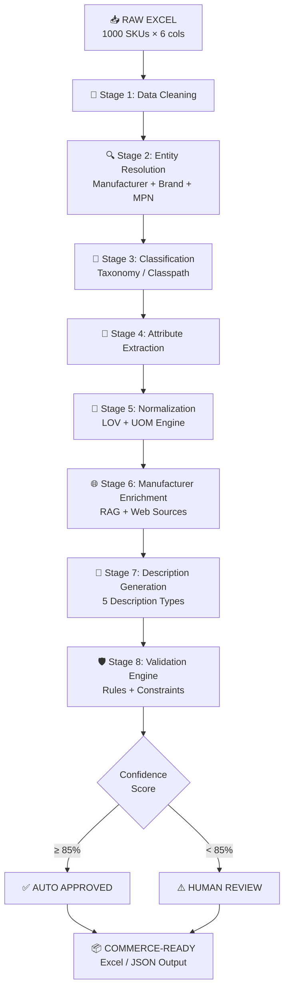
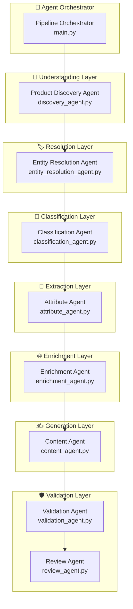

# 🏆 UniHack Masterplan — Product Intelligence Agent

> **One-liner:** *An evidence-driven Product Intelligence Agent that converts incomplete industrial SKU data into validated, standardized, and commerce-ready content.*

---

## Table of Contents

1. [Problem Statement](#1-problem-statement)
2. [What Judges Want](#2-what-judges-want)
3. [How We Solve It](#3-how-we-solve-it)
4. [End-to-End Architecture](#4-end-to-end-architecture)
5. [Data Analysis](#5-data-analysis)
6. [Tech Stack](#6-tech-stack)
7. [Folder Structure](#7-folder-structure)
8. [Phase-Wise Implementation](#8-phase-wise-implementation)
9. [Agent Roles & Responsibilities](#9-agent-roles--responsibilities)
10. [Key Differentiators](#10-key-differentiators)
11. [Evaluation & Benchmarking](#11-evaluation--benchmarking)
12. [Demo Strategy](#12-demo-strategy)
13. [Presentation Script](#13-presentation-script)
14. [How We Win](#14-how-we-win)

---

## 1. Problem Statement

### The Real-World Pain

Industrial B2B distributors receive product data from hundreds of manufacturers in wildly inconsistent formats. A typical raw SKU looks like:

```
MPN: 3/8 CPLG BRS 150#
Description: 3/8 CPLG BRS 150# — Coupling
Brand: -- Unbranded --
Manufacturer: Freud Inc (2435)
```

This is **unusable for commerce**. Buyers cannot search, filter, or compare products. E-commerce platforms need:

| What's Missing | Why It Matters |
|---|---|
| Canonical Manufacturer Name | Search & filtering breaks |
| Standardized Brand | Brand pages & trust fail |
| Product Classification (Classpath) | Category navigation dies |
| Structured Attributes | Comparison & filtering impossible |
| Standardized UOMs | Inconsistent specifications |
| Multiple Description Types | SEO, mobile, invoice all need different formats |
| Source Evidence | No traceability for audits |

### The Challenge Scope

| Metric | Value |
|---|---|
| Input Rows | **1,000 raw SKUs** |
| Ground Truth Rows | **2 fully enriched examples** (Delivery Format) |
| Input Fields | **6 columns** (MPN, Desc, E1_Brand, Unilog_Brand, DIB_Brand, Part_Manuf) |
| Output Fields | **~252 columns** (Descriptions, Attributes×50, URLs, Images, Documents) |
| Unique Manufacturers | **77** (Phillips Lighting: 111, Milwaukee: 108, Boise Cascade: 85, etc.) |
| Brand Quality | **79.9% are "-- Unbranded --"** — needs resolution |
| Product Categories | Abrasives, Appliances, Decking, Lighting, Power Tools, Blades, Electrical, Safety, etc. |

### What Exactly Must Be Generated

From those 6 input columns, produce:

```
├── Identity Fields
│   ├── MANUFACTURER_NAME (canonical)
│   ├── BRAND_NAME (resolved)
│   ├── TRADE_NAME
│   ├── MANUFACTURER_PART_NUMBER
│   └── ALTERNATE_PART_NUMBER
│
├── Classification
│   └── Classpath (e.g., "Appliances & Consumer Electronics>Kitchen Appliances>Built-In Dishwashers")
│
├── Descriptions (5 types)
│   ├── MOBILE_DESC
│   ├── INVOICE_DESC
│   ├── SHORT_DESC
│   ├── LONG_DESC1
│   └── RETAIL_DESC / MARKETING_DESCRIPTION
│
├── Features (up to 20)
│   ├── ITEM_FEATURES_1 through ITEM_FEATURES_20
│
├── Attributes (up to 50 triplets)
│   ├── ATTRIBUTE_LABEL_1, ATTRIBUTE_VALUE_1, ATTRIBUTE_UOM_1
│   ├── ... through ...
│   └── ATTRIBUTE_LABEL_50, ATTRIBUTE_VALUE_50, ATTRIBUTE_UOM_50
│
├── Supplementary
│   ├── With, Standard/Approvals, Prop 65, Application, Includes, Product Name
│   ├── UPC, EAN, GTIN, UNSPSC
│   ├── Warranty, List Price, Selling Qty/UOM
│   └── Dimensions (LENGTH, HEIGHT, WIDTH, WEIGHT, VOLUME + UOMs)
│
├── Media & Documentation
│   ├── Product Image + Alternate Images (×4)
│   ├── SDS, Specification Sheet, Catalog, Manual, etc.
│   └── Video Links
│
└── Source Evidence
    ├── MFR URL
    └── Ref URL 1-5
```

---

## 2. What Judges Want

UniHack evaluates on **four pillars**. Here's exactly how we score on each:

### Pillar 1: Innovation (25%)

| Judge Expectation | Our Response |
|---|---|
| Not just "Excel → LLM → Excel" | Hybrid: Deterministic Rules + Fuzzy Matching + Constrained RAG + LLM + Validation |
| Something original | Evidence Graph — every generated value has traceable provenance |
| Creative problem solving | LOV-constrained extraction: LLM proposes, validators dispose |
| AI that's trustworthy | Confidence scoring + automatic human review routing |

### Pillar 2: Technical Implementation (25%)

| Judge Expectation | Our Response |
|---|---|
| Working MVP/POC | End-to-end pipeline processing 1000 rows |
| Code quality | Modular agent architecture, each agent independently testable |
| AI/ML depth | Multi-agent system + RAG + NER + fuzzy matching + classification |
| Scalability | Batch processing with metrics: 1→10→100→1000 SKUs |

### Pillar 3: Business Relevance (25%)

| Judge Expectation | Our Response |
|---|---|
| Solves Unilog's actual problem | Directly targets their CX1 PIM content enrichment workflow |
| Understands the domain | Uses their LOV, UOM, manufacturer master vocabulary |
| Production viability | Not a toy — includes validation engine, confidence scoring, human review |
| Aligns with Unilog's direction | Mirrors their HyperScale AI agent architecture |

### Pillar 4: Overall Impact (25%)

| Judge Expectation | Our Response |
|---|---|
| Tangible value | Measurable accuracy benchmarks against ground truth |
| Scale potential | Demonstrates 1→1000 SKU processing with timing metrics |
| Reduce manual work | Auto-approve high-confidence records, flag only low-confidence for review |
| Better commerce outcomes | Better product data → better search → better buying experience |

---

## 3. How We Solve It

### Core Philosophy

> **NOT:** "Let the LLM freely generate everything"
>
> **YES:** "LLM proposes → Deterministic systems validate → Evidence backs every decision"

### The Pipeline in One Sentence

```
Raw SKU → Clean → Resolve Entity → Classify → Extract Attributes → Normalize (LOV + UOM) → Enrich from Manufacturer → Generate Descriptions → Validate → Score Confidence → Auto-Approve or Human Review → Commerce-Ready Output
```

### Why Hybrid > Pure LLM

```
┌───────────────────────────────────────────────────────────┐
│                    PURE LLM APPROACH                      │
│                                                           │
│   Excel → Prompt → LLM → Excel                           │
│                                                           │
│   Problems:                                               │
│   ❌ Hallucinations (invents attribute values)             │
│   ❌ No LOV compliance                                    │
│   ❌ No UOM standardization                               │
│   ❌ No traceability                                      │
│   ❌ No confidence scoring                                │
│   ❌ Looks like every other hackathon project              │
└───────────────────────────────────────────────────────────┘

┌───────────────────────────────────────────────────────────┐
│                  OUR HYBRID APPROACH                       │
│                                                           │
│   Excel → Clean → Fuzzy Match → LLM + LOV → Normalize    │
│   → Enrich → Generate → Validate → Confidence → Output    │
│                                                           │
│   Advantages:                                             │
│   ✅ Zero hallucination (LOV-constrained)                  │
│   ✅ 100% UOM compliance (deterministic normalization)     │
│   ✅ Full traceability (evidence graph)                    │
│   ✅ Confidence scoring (auto/manual review split)         │
│   ✅ Production-grade architecture                         │
│   ✅ Looks like Unilog's own HyperScale vision             │
└───────────────────────────────────────────────────────────┘
```

---

## 4. End-to-End Architecture

### High-Level Pipeline



### Detailed Component Architecture

```
                    ┌─────────────────────────────────────┐
                    │         RAW SKU / EXCEL INPUT        │
                    │  MPN | Part_Desc | Brand | Manuf    │
                    └──────────────────┬──────────────────┘
                                       │
                    ┌──────────────────▼──────────────────┐
                    │       🧹 INPUT INTELLIGENCE          │
                    │                                      │
                    │  • "-- Unbranded --" → null           │
                    │  • "-- No Unilog Brand --" → null     │
                    │  • Whitespace / casing cleanup        │
                    │  • Duplicate MPN detection            │
                    │  • Extract embedded info from desc    │
                    └──────────────────┬──────────────────┘
                                       │
                    ┌──────────────────▼──────────────────┐
                    │     🔍 ENTITY RESOLUTION ENGINE       │
                    │                                      │
                    │  ┌──────────┐    ┌──────────┐        │
                    │  │ Manuf    │    │ Brand    │        │
                    │  │ Master   │    │ Master   │        │
                    │  │ (27K)    │    │ Lookup   │        │
                    │  └────┬─────┘    └────┬─────┘        │
                    │       │               │              │
                    │  Exact Match → Direct Resolution     │
                    │  Fuzzy Match → Candidate Generation  │
                    │  Cross-Check → Brand ↔ Manuf         │
                    │  Output: Canonical Name + Confidence │
                    └──────────────────┬──────────────────┘
                                       │
                    ┌──────────────────▼──────────────────┐
                    │     📂 CLASSIFICATION ENGINE          │
                    │                                      │
                    │  Inputs: Desc + MPN + Manufacturer   │
                    │                                      │
                    │  Step 1: Category prediction (LLM)   │
                    │  Step 2: Classpath matching (LOV)     │
                    │  Step 3: Validation against taxonomy  │
                    │                                      │
                    │  Output: "Appliances > Kitchen        │
                    │           Appliances > Dishwashers"   │
                    └──────────────────┬──────────────────┘
                                       │
                    ┌──────────────────▼──────────────────┐
                    │    🧩 ATTRIBUTE EXTRACTION AGENT      │
                    │                                      │
                    │  ┌─────────────────────────────┐     │
                    │  │ LLM extracts candidates     │     │
                    │  │ "3/8 CPLG BRS 150#"         │     │
                    │  │  → Size: 3/8                │     │
                    │  │  → Type: CPLG               │     │
                    │  │  → Material: BRS            │     │
                    │  │  → Rating: 150#             │     │
                    │  └──────────┬──────────────────┘     │
                    │             │                        │
                    │  ┌──────────▼──────────────────┐     │
                    │  │ LOV validates candidates    │     │
                    │  │  → Size ∈ LOV? ✅            │     │
                    │  │  → Type ∈ LOV? ✅            │     │
                    │  │  → Material ∈ LOV? ✅        │     │
                    │  │  → Invalid values → REJECT  │     │
                    │  └────────────────────────────┘     │
                    └──────────────────┬──────────────────┘
                                       │
                         ┌─────────────┴─────────────┐
                         │                           │
              ┌──────────▼──────────┐    ┌───────────▼─────────┐
              │   📚 LOV STORE       │    │   📐 UOM ENGINE      │
              │                     │    │                      │
              │  Category → Labels  │    │  inch/inches → in    │
              │  Label → Values     │    │  0.5 in → 1/2 in    │
              │  Constraints        │    │  BR/Brass → Brass    │
              │                     │    │  CPLG → Coupling     │
              │  Deterministic      │    │  Deterministic       │
              │  Lookup Tables      │    │  Lookup Tables       │
              └──────────┬──────────┘    └───────────┬─────────┘
                         │                           │
                         └─────────────┬─────────────┘
                                       │
                    ┌──────────────────▼──────────────────┐
                    │   🌐 MANUFACTURER ENRICHMENT         │
                    │                                      │
                    │  MPN → Manufacturer website search   │
                    │       → Product documentation parse  │
                    │       → Spec sheet extraction        │
                    │       → Validate against LOV         │
                    │       → Store source URL + evidence  │
                    │                                      │
                    │  ⚠️  Manufacturer sources ONLY        │
                    │     (NOT Amazon/distributor sites)    │
                    └──────────────────┬──────────────────┘
                                       │
                    ┌──────────────────▼──────────────────┐
                    │   📋 EVIDENCE & PROVENANCE LAYER     │
                    │                                      │
                    │  Every attribute gets:               │
                    │  {                                    │
                    │    "value": "120 V",                  │
                    │    "confidence": 0.98,                │
                    │    "source": "mfr_documentation",     │
                    │    "source_url": "https://...",       │
                    │    "extraction_method": "spec_sheet", │
                    │    "validated_by": "LOV + UOM"        │
                    │  }                                    │
                    └──────────────────┬──────────────────┘
                                       │
                    ┌──────────────────▼──────────────────┐
                    │   ✍️ CONTENT GENERATION               │
                    │                                      │
                    │  From SAME validated attribute obj:   │
                    │                                      │
                    │  → MOBILE_DESC (compact)              │
                    │    "Rheem FRIGIDAIRE, Dishwasher,     │
                    │     Professional Series, PDSH4816AF"  │
                    │                                      │
                    │  → INVOICE_DESC (abbreviated)         │
                    │    "DISHWASHER LEG 5 SST 120V 15A"   │
                    │                                      │
                    │  → SHORT_DESC (structured title)      │
                    │    "FRIGIDAIRE® Professional Series   │
                    │     PDSH4816AF Dishwasher..."         │
                    │                                      │
                    │  → LONG_DESC1 (full specification)    │
                    │    "FRIGIDAIRE® Dishwasher With       │
                    │     CleanBoost™, Professional..."     │
                    │                                      │
                    │  → RETAIL_DESC (marketing copy)       │
                    │    Engaging description for shoppers  │
                    └──────────────────┬──────────────────┘
                                       │
                    ┌──────────────────▼──────────────────┐
                    │   🛡️ VALIDATION ENGINE                │
                    │                                      │
                    │  ☑ LOV validation                    │
                    │  ☑ Manufacturer master validation    │
                    │  ☑ Brand master validation           │
                    │  ☑ UOM standardization check         │
                    │  ☑ Character limit compliance        │
                    │  ☑ Required field completeness       │
                    │  ☑ Casing rules (Title Case, etc.)   │
                    │  ☑ Title formula compliance          │
                    │  ☑ Attribute ordering                │
                    │  ☑ Source URL availability            │
                    └──────────────────┬──────────────────┘
                                       │
                         ┌─────────────┴─────────────┐
                         │                           │
              ┌──────────▼──────────┐    ┌───────────▼─────────┐
              │  ✅ AUTO APPROVED    │    │  ⚠️ HUMAN REVIEW     │
              │                     │    │                      │
              │  Confidence ≥ 85%   │    │  Confidence < 85%    │
              │  All validators ✓   │    │  Some validators ✗   │
              │                     │    │  Flagged fields only  │
              └──────────┬──────────┘    └───────────┬─────────┘
                         │                           │
                         └─────────────┬─────────────┘
                                       │
                    ┌──────────────────▼──────────────────┐
                    │   📦 COMMERCE-READY OUTPUT            │
                    │                                      │
                    │  Excel (Delivery Format)             │
                    │  + JSON (API-ready)                   │
                    │  + Evidence Report                    │
                    │  + Quality Dashboard                 │
                    └─────────────────────────────────────┘
```

---

## 5. Data Analysis

### Input Dataset Breakdown

**File:** [Unihack_ Sample Dataset - Input.csv](file:///e:/Desktop/UNIHACK/Unihack_%20Sample%20Dataset%20-%20Input.csv)

| Field | Column | Quality |
|---|---|---|
| `Mfg_Part_Num` | MPN identifier | Mostly present, some have manufacturer prefix |
| `Part_Desc` | Raw description | Cryptic abbreviations, inconsistent formatting |
| `E1_Brand` | Primary brand | **79.9% are "-- Unbranded --"** |
| `Unilog_Brand` | Unilog brand | Almost all "-- No Unilog Brand --" |
| `DIB_Brand` | DIB brand | Mix of brands and "-- No DIB Brand --" |
| `Part_Manuf` | Manufacturer | Present but needs canonical resolution |

### Manufacturer Distribution (Top 10)

| Manufacturer | Count | Category Focus |
|---|---|---|
| Phillips Lighting (5831) | 111 | LED Bulbs, Lighting |
| Milwaukee Accessory (4031) | 108 | Power Tool Accessories, Blades |
| Boise Cascade (BOICA) | 85 | Decking (Trex, TimberTech) |
| Appliance Dealers Cooperative (APPDE) | 84 | Kitchen Appliances |
| Kichler Lighting (KICLI) | 56 | Decorative Lighting |
| Parksite (6151) | 55 | Building Materials |
| Black & Decker/dewlt (2585) | 55 | Power Tools (DeWalt) |
| Freud Inc (2435) | 46 | Saw Blades (Diablo brand) |
| U S Lumber (3073) | 43 | Lumber / Building |
| Satco Prod Inc (5573) | 41 | Lighting |

### Brand Quality Crisis

| Brand Status | Count | % |
|---|---|---|
| `-- Unbranded --` | 799 | 79.9% |
| `TREX` | 122 | 12.2% |
| `TIMBERTECH` | 55 | 5.5% |
| Other (9 brands) | 24 | 2.4% |

> [!CAUTION]
> **80% of products have NO brand information.** This is the primary entity resolution challenge. Our system must intelligently resolve brands from manufacturer names, product descriptions, and MPN patterns.

### Product Category Diversity

| Category | Example Description | Count (approx) |
|---|---|---|
| **Abrasives** | "Diablo 1/2"×18" Sanding Belt" | ~60 |
| **Appliances** | "PDSH4816AF Dishwasher SS" | ~84 |
| **Blades / Cutting** | "Milw 7-1/4in. 24T Framing Circ Saw Blade" | ~60 |
| **Decking** | "1nx6-16' Honey Grove Grooved - Trex Enhance Naturals" | ~85 |
| **Electrical** | "Leviton GFCI Receptacle" | ~30 |
| **Lighting** | "571463 100W Led BR30 Med 50k" | ~200 |
| **Power Tools** | "Milw M18 FUEL Hammer Drill/Impact Driver Kit" | ~110 |
| **Safety** | "Edge Eyewear Safety Glasses" | ~15 |
| **Woodworking** | "Oliver 3HP 230V 1PH Shaper" | ~50 |
| **Building Materials** | "LP SmartSide Siding Panel" | ~50+ |

### Output Format Analysis

**File:** [Unihack_ Expected Output - Delivery Format.csv](file:///e:/Desktop/UNIHACK/Unihack_%20Expected%20Output%20-%20Delivery%20Format.csv)

| Section | Fields | Count |
|---|---|---|
| Source URLs | MFR URL, Ref URL 1-5 | 6 |
| Identity | PART_NUMBER, SKU, MPN, Manufacturer, Brand, Trade Name | ~10 |
| Classification | Dept, Class, Fine, Classpath | 4 |
| Descriptions | MOBILE, INVOICE, SHORT, LONG, RETAIL, MARKETING | 6 |
| Features | ITEM_FEATURES_1 through 20 | 20 |
| Supplementary | With, Standards, Prop65, Application, Includes, Product Name | 6 |
| Attributes | LABEL/VALUE/UOM × 50 | 150 |
| Commerce | UPC, EAN, GTIN, UNSPSC, Warranty, Price, Qty, UOM | 8 |
| Dimensions | L/H/W/Weight/Volume + UOMs | 10 |
| Media | Product Image, Alt Images × 4, Documents × 15+ | ~20 |
| **Total** | | **~252 columns** |

---

## 6. Tech Stack

### Core Framework

| Layer | Technology | Why |
|---|---|---|
| **Language** | Python 3.11+ | Rich ML/AI ecosystem, pandas for data, rapid prototyping |
| **Web Framework** | FastAPI | Async, modern, auto-docs, perfect for demo API |
| **Frontend** | Next.js 14 (React) | Rich UI for dashboard, SSR for demo speed |
| **Styling** | Tailwind CSS + shadcn/ui | Rapid premium UI development |

### AI / ML Stack

| Component | Technology | Purpose |
|---|---|---|
| **LLM** | Google Gemini 2.0 Flash / Pro | Classification, extraction, description generation |
| **Embeddings** | `text-embedding-004` (Gemini) | Semantic similarity for fuzzy matching |
| **Vector Store** | ChromaDB / FAISS | LOV and manufacturer master embeddings |
| **NER / Extraction** | SpaCy + Custom Rules | Named entity recognition for attributes |
| **Fuzzy Matching** | RapidFuzz + Levenshtein | Manufacturer/brand entity resolution |

### Data & Processing

| Component | Technology | Purpose |
|---|---|---|
| **Data Processing** | Pandas + Polars | DataFrame operations, CSV I/O |
| **Normalization** | Custom Python + Lookup Tables | UOM, abbreviation, fraction conversion |
| **Web Scraping** | httpx + BeautifulSoup | Manufacturer website enrichment |
| **Caching** | SQLite / Redis | Cache LLM responses, web scrape results |

### Infrastructure

| Component | Technology | Purpose |
|---|---|---|
| **Task Queue** | Celery / asyncio | Parallel batch processing |
| **API** | FastAPI + Pydantic | Structured input/output validation |
| **Database** | SQLite (demo) / PostgreSQL (prod) | Evidence storage, audit trail |
| **Logging** | Loguru | Structured pipeline logging |

---

## 7. Folder Structure

```
UNIHACK/
│
├── 📄 README.md                          # Project overview + setup instructions
├── 📄 requirements.txt                   # Python dependencies
├── 📄 .env.example                       # Environment variable template
├── 📄 docker-compose.yml                 # (Optional) Containerized deployment
│
├── 📂 data/                              # All data files
│   ├── 📂 raw/                           # Original challenge data
│   │   ├── Unihack_ Sample Dataset - Input.csv
│   │   └── Unihack_ Expected Output - Delivery Format.csv
│   │
│   ├── 📂 masters/                       # Reference/master data
│   │   ├── manufacturer_master.json      # 27K manufacturer canonical names
│   │   ├── brand_master.json             # Brand lookup table
│   │   ├── category_taxonomy.json        # Product classification tree
│   │   ├── lov_store.json                # List of Values per category
│   │   ├── uom_mapping.json              # UOM standardization rules
│   │   ├── abbreviation_map.json         # CPLG→Coupling, BRS→Brass, etc.
│   │   └── fraction_decimal_map.json     # 0.5→1/2, 0.25→1/4, etc.
│   │
│   ├── 📂 processed/                     # Pipeline outputs
│   │   ├── cleaned.csv                   # After Stage 1
│   │   ├── resolved.csv                  # After Stage 2
│   │   ├── classified.csv                # After Stage 3
│   │   ├── extracted.csv                 # After Stage 4-5
│   │   ├── enriched.csv                  # After Stage 6
│   │   └── final_output.csv             # Delivery Format output
│   │
│   └── 📂 evidence/                      # Evidence/provenance data
│       ├── evidence_graph.json            # Full evidence trail
│       └── source_cache.json             # Cached manufacturer lookups
│
├── 📂 src/                               # Core pipeline source code
│   ├── 📄 __init__.py
│   ├── 📄 config.py                      # Configuration & constants
│   ├── 📄 main.py                        # Pipeline orchestrator
│   │
│   ├── 📂 agents/                        # AI Agent modules
│   │   ├── 📄 __init__.py
│   │   ├── 📄 base_agent.py              # Abstract base agent class
│   │   ├── 📄 discovery_agent.py         # Stage 1: Raw understanding
│   │   ├── 📄 entity_resolution_agent.py # Stage 2: Manufacturer + Brand
│   │   ├── 📄 classification_agent.py    # Stage 3: Taxonomy/Classpath
│   │   ├── 📄 attribute_agent.py         # Stage 4: Extraction
│   │   ├── 📄 enrichment_agent.py        # Stage 6: Manufacturer search
│   │   ├── 📄 content_agent.py           # Stage 7: Description generation
│   │   ├── 📄 validation_agent.py        # Stage 8: Rules & constraints
│   │   └── 📄 review_agent.py            # Stage 9: Confidence & routing
│   │
│   ├── 📂 engines/                       # Deterministic processing engines
│   │   ├── 📄 __init__.py
│   │   ├── 📄 cleaning_engine.py         # Data cleaning & normalization
│   │   ├── 📄 fuzzy_matcher.py           # RapidFuzz entity matching
│   │   ├── 📄 lov_engine.py              # LOV constraint validation
│   │   ├── 📄 uom_engine.py              # UOM standardization
│   │   ├── 📄 normalization_engine.py    # Abbreviation + fraction conversion
│   │   └── 📄 validation_engine.py       # Multi-rule validation
│   │
│   ├── 📂 rag/                           # RAG components
│   │   ├── 📄 __init__.py
│   │   ├── 📄 embeddings.py              # Embedding generation
│   │   ├── 📄 vector_store.py            # ChromaDB / FAISS wrapper
│   │   ├── 📄 retriever.py               # Evidence retrieval
│   │   └── 📄 query_planner.py           # Smart query planning
│   │
│   ├── 📂 llm/                           # LLM interaction layer
│   │   ├── 📄 __init__.py
│   │   ├── 📄 client.py                  # Gemini API client
│   │   ├── 📄 prompts.py                 # All prompt templates
│   │   └── 📄 structured_output.py       # Pydantic output schemas
│   │
│   ├── 📂 models/                        # Data models
│   │   ├── 📄 __init__.py
│   │   ├── 📄 product.py                 # Product data model
│   │   ├── 📄 attribute.py               # Attribute triplet model
│   │   ├── 📄 evidence.py                # Evidence/provenance model
│   │   └── 📄 confidence.py              # Confidence scoring model
│   │
│   └── 📂 utils/                         # Utilities
│       ├── 📄 __init__.py
│       ├── 📄 csv_handler.py             # CSV read/write
│       ├── 📄 logger.py                  # Structured logging
│       └── 📄 metrics.py                 # Performance metrics
│
├── 📂 frontend/                          # Next.js dashboard
│   ├── 📄 package.json
│   ├── 📂 app/
│   │   ├── 📄 page.tsx                   # Main dashboard
│   │   ├── 📄 layout.tsx                 # App layout
│   │   ├── 📂 pipeline/
│   │   │   └── 📄 page.tsx               # Pipeline visualization
│   │   ├── 📂 product/[id]/
│   │   │   └── 📄 page.tsx               # Product detail + evidence
│   │   ├── 📂 review/
│   │   │   └── 📄 page.tsx               # Human review queue
│   │   └── 📂 benchmark/
│   │       └── 📄 page.tsx               # Evaluation dashboard
│   │
│   └── 📂 components/
│       ├── 📄 PipelineFlow.tsx            # Visual pipeline diagram
│       ├── 📄 ProductCard.tsx             # Product summary card
│       ├── 📄 EvidenceGraph.tsx           # Evidence tree visualization
│       ├── 📄 ConfidenceMeter.tsx         # Confidence score display
│       ├── 📄 BenchmarkChart.tsx          # Accuracy metrics chart
│       └── 📄 ReviewQueue.tsx             # Human review interface
│
├── 📂 api/                               # FastAPI backend
│   ├── 📄 main.py                        # API entry point
│   ├── 📄 routes.py                      # API routes
│   └── 📄 schemas.py                     # Request/response schemas
│
├── 📂 evaluation/                        # Benchmarking & evaluation
│   ├── 📄 benchmark.py                   # Run benchmarks against ground truth
│   ├── 📄 metrics.py                     # Accuracy, compliance metrics
│   ├── 📄 compare.py                     # Compare output vs delivery format
│   └── 📄 report_generator.py            # Generate evaluation report
│
├── 📂 tests/                             # Unit & integration tests
│   ├── 📄 test_cleaning.py
│   ├── 📄 test_entity_resolution.py
│   ├── 📄 test_classification.py
│   ├── 📄 test_attribute_extraction.py
│   ├── 📄 test_normalization.py
│   ├── 📄 test_validation.py
│   └── 📄 test_pipeline_e2e.py
│
├── 📂 notebooks/                         # Exploration & analysis
│   ├── 📄 01_data_exploration.ipynb
│   ├── 📄 02_entity_resolution_dev.ipynb
│   ├── 📄 03_classification_dev.ipynb
│   └── 📄 04_benchmark_analysis.ipynb
│
└── 📂 docs/                              # Documentation
    ├── 📄 architecture.md                 # System architecture doc
    ├── 📄 pipeline_stages.md              # Detailed stage documentation
    └── 📄 presentation.md                 # Presentation script/notes
```

---

## 8. Phase-Wise Implementation

### Phase 0: Setup & Foundation (Day 1 — 4 hours)

```
Priority: 🔴 CRITICAL
```

**Tasks:**
- [ ] Set up Python project structure (as per folder structure above)
- [ ] Install core dependencies: `pandas`, `rapidfuzz`, `google-generativeai`, `fastapi`, `chromadb`, `pydantic`, `loguru`
- [ ] Create data models (`Product`, `Attribute`, `Evidence`, `Confidence`)
- [ ] Build CSV handler (read input, write delivery format)
- [ ] Load and parse the 2 ground truth examples from delivery format
- [ ] Set up Gemini API client with rate limiting
- [ ] Create base agent class with logging + error handling
- [ ] Build initial config with all constants

**Deliverable:** Skeleton project that can read input CSV and write empty delivery format CSV.

---

### Phase 1: Data Cleaning + Entity Resolution (Day 1-2 — 8 hours)

```
Priority: 🔴 CRITICAL — Foundation for everything else
```

#### Stage 1: Data Cleaning Engine

```python
# What it does:
"-- Unbranded --"          → None
"-- No Unilog Brand --"    → None
"-- No DIB Brand --"       → None
"Freud Inc (2435)"         → {"name": "Freud Inc", "code": "2435"}
"  extra  whitespace  "    → "extra whitespace"
```

- [ ] Implement sentinel value detection and nullification
- [ ] Parse `Part_Manuf` field into structured components (name + code)
- [ ] Clean whitespace, normalize casing
- [ ] Detect duplicate MPNs
- [ ] Extract embedded brand/product info from `Part_Desc`

#### Stage 2: Entity Resolution

```python
# Manufacturer Resolution Examples:
"Phillips Lighting (5831)"    → "Philips Lighting"       # Spelling fix
"Black & Decker/dewlt (2585)" → "BLACK+DECKER / DeWALT"  # Canonical
"Milwaukee Accessory (4031)"  → "Milwaukee Tool"          # Brand alignment
"Freud Inc (2435)"            → "Freud / Diablo"          # Product brand

# Brand Resolution Examples:
"-- Unbranded --" + Manuf="Milwaukee Accessory" → Brand="Milwaukee"
"-- Unbranded --" + Desc contains "Diablo"      → Brand="Diablo"
"TREX"                                           → Brand="Trex®"
```

- [ ] Build manufacturer fuzzy matcher (RapidFuzz, threshold 85%)
- [ ] Build brand inference from manufacturer + description
- [ ] Cross-validate brand ↔ manufacturer consistency
- [ ] Output confidence scores for each resolution
- [ ] Create manufacturer → canonical brand mapping table

**Deliverable:** All 1000 rows have resolved Manufacturer + Brand with confidence scores.

---

### Phase 2: Classification + Attribute Extraction (Day 2-3 — 10 hours)

```
Priority: 🔴 CRITICAL — Core intelligence layer
```

#### Stage 3: Product Classification

```python
# Classification Examples:
"PDSH4816AF Dishwasher SS"
→ Classpath: "Appliances & Consumer Electronics > Kitchen Appliances > Built-In Dishwashers"

"49-94-0013 Milw 5" Metal Cut Off Disc"
→ Classpath: "Abrasives > Bonded Abrasives > Cut-Off Wheels"

"1nx6-16' Honey Grove Grooved - Trex Enhance Naturals Decking"
→ Classpath: "Building Materials > Decking > Composite Decking Boards"
```

- [ ] Build category taxonomy from ground truth examples + web research
- [ ] Create classification prompt with few-shot examples
- [ ] LLM classifies → validate against taxonomy tree
- [ ] Assign Dept / Class / Fine line from classpath
- [ ] Confidence scoring per classification

#### Stage 4: Attribute Extraction

```python
# Extraction Example:
Input: "49-94-0013 Milw 5"×.045"×7/8" Metal Cut Off Disc"

LLM Extracts:
  Diameter    = 5 in
  Thickness   = 0.045 in
  Arbor Size  = 7/8 in
  Material    = Metal
  Type        = Cut-Off Disc
  Brand       = Milwaukee (already resolved)
```

- [ ] Build extraction prompt per category (different attributes per category)
- [ ] LLM extracts raw candidates
- [ ] Map to ATTRIBUTE_LABEL / ATTRIBUTE_VALUE / ATTRIBUTE_UOM triplets
- [ ] Validate each value against LOV (reject invalid)
- [ ] Ensure correct attribute ordering per category

#### Stage 5: Normalization

```python
# UOM Normalization:
"inch" / "inches" / "in." / '"' → "in"
"0.5 in"                        → "1/2 in"
"volt" / "volts"                → "V"
"kilowatt-hour"                → "kW-hr"

# Abbreviation Expansion:
"CPLG"  → "Coupling"
"BRS"   → "Brass"
"SST"   → "Stainless Steel"
"DKO"   → "Depressed Center"
"Milw"  → "Milwaukee"
"Led"   → "LED"
```

- [ ] Build UOM lookup table (deterministic, no LLM)
- [ ] Build decimal ↔ fraction converter
- [ ] Build abbreviation expansion map
- [ ] Apply normalization pipeline to all extracted attributes
- [ ] Validate normalized values against LOV

**Deliverable:** All 1000 rows classified + attributes extracted + normalized.

---

### Phase 3: Content Generation + Validation (Day 3-4 — 8 hours)

```
Priority: 🟡 HIGH — Makes output submission-ready
```

#### Stage 7: Description Generation

All 5 description types generated from the **same validated attribute object** (not independently by LLM):

```python
# From validated attributes for PDSH4816AF:

MOBILE_DESC:    "Rheem Manufacturing FRIGIDAIRE, Dishwasher, Professional Series, PDSH4816AF"
                # Format: "{Manufacturer} {Brand}, {Product}, {Series}, {MPN}"
                # Char limit: ~100

INVOICE_DESC:   "DISHWASHER LEG 5 SST 120V 15A 50-1/4IN"
                # Format: ALL CAPS, abbreviated, key specs only
                # Char limit: ~50

SHORT_DESC:     "FRIGIDAIRE® Professional Series PDSH4816AF Dishwasher With CleanBoost™..."
                # Format: "{Brand} {Series} {MPN} {Product} {Key Feature}"
                # Char limit: ~150

LONG_DESC1:     "FRIGIDAIRE® Dishwasher With CleanBoost™, Professional Series, 5 Wash Cycles..."
                # Format: Full specification string with all attributes
                # Char limit: ~500

RETAIL_DESC:    "Professional Series Dishwasher, Leg Mounting, 5-Wash Cycle, Stainless Steel"
                # Format: Human-friendly, key selling points
```

- [ ] Build description templates per category
- [ ] Create prompt with format constraints + char limits
- [ ] Generate from validated attributes (NOT raw description)
- [ ] Apply character limit validation
- [ ] Apply casing rules (Title Case, ALL CAPS for invoice, etc.)

#### Feature Generation

```python
# Features 1-20 from attributes:
ITEM_FEATURES_1:  "3rd rack with extra wash action"
ITEM_FEATURES_2:  "Adjustable 2nd Rack"
ITEM_FEATURES_3:  "41 dBA"
...
```

- [ ] Extract key selling points from attributes
- [ ] Generate concise feature bullets
- [ ] Limit to most important features (up to 20)

#### Stage 8: Validation Engine

- [ ] LOV compliance checker (every attribute value ∈ allowed values)
- [ ] UOM compliance checker (standardized units only)
- [ ] Character limit validator per field
- [ ] Required field completeness checker
- [ ] Casing rule validator
- [ ] Manufacturer ↔ Brand consistency validator
- [ ] Classpath structure validator
- [ ] Source URL format validator

**Deliverable:** Full delivery format CSV with all descriptions + validated attributes.

---

### Phase 4: Enrichment + Evidence (Day 4-5 — 8 hours)

```
Priority: 🟡 HIGH — Major differentiator
```

#### Stage 6: Manufacturer Source Enrichment

```python
# Flow:
MPN: "PDSH4816AF"
  → Search: frigidaire.com/PDSH4816AF
  → Found: Product page with specs
  → Extract: Voltage=120V, Cycles=5, Material=Stainless Steel
  → Validate: Each value against LOV
  → Store: {
      "source_url": "https://www.frigidaire.com/en/p/.../PDSH4816AF",
      "source_type": "manufacturer_website",
      "extracted_at": "2026-08-12T10:00:00Z"
    }
```

- [ ] Build manufacturer URL resolver (MPN → manufacturer website URL)
- [ ] Web scraper for product pages (httpx + BeautifulSoup)
- [ ] Spec sheet PDF parser (optional — high-value)
- [ ] Extract structured data from manufacturer pages
- [ ] Validate extracted data against LOV
- [ ] Store evidence with source URL + extraction method
- [ ] Populate MFR URL and Ref URL 1-5 fields

#### Evidence Graph

```python
# Evidence structure per product:
{
  "product_id": "PDSH4816AF",
  "evidence": {
    "brand": {
      "value": "FRIGIDAIRE®",
      "confidence": 0.99,
      "source": "manufacturer_website",
      "source_url": "https://frigidaire.com/...",
      "method": "direct_match"
    },
    "voltage": {
      "value": "120 V",
      "confidence": 0.98,
      "source": "spec_sheet",
      "source_url": "https://frigidaire.com/.../spec.pdf",
      "method": "document_extraction"
    }
  }
}
```

- [ ] Build evidence data model
- [ ] Attach evidence to every generated attribute
- [ ] Calculate per-field confidence scores
- [ ] Generate overall product confidence

**Deliverable:** Evidence-backed enrichment for as many products as possible.

---

### Phase 5: Dashboard + Demo (Day 5-6 — 10 hours)

```
Priority: 🟡 HIGH — Presentation impact
```

#### Frontend Dashboard

- [ ] **Main Dashboard:** Pipeline overview, processing stats, status
- [ ] **Pipeline Visualization:** Animated flow showing data through stages
- [ ] **Product Detail Page:** Click any product → see all fields + evidence tree
- [ ] **Evidence Graph UI:** Interactive tree showing why each value was chosen
- [ ] **Confidence Meter:** Visual confidence scores per field
- [ ] **Human Review Queue:** List of low-confidence products with flagged fields
- [ ] **Benchmark Dashboard:** Accuracy metrics chart vs ground truth

#### API Endpoints

```
POST   /api/process          # Process single SKU
POST   /api/batch             # Process batch of SKUs
GET    /api/product/{id}      # Get enriched product
GET    /api/evidence/{id}     # Get evidence for product
GET    /api/review/queue      # Get human review queue
GET    /api/benchmark         # Get accuracy metrics
GET    /api/pipeline/status   # Get pipeline status
```

**Deliverable:** Working demo with visual dashboard.

---

### Phase 6: Evaluation + Polish (Day 6-7 — 6 hours)

```
Priority: 🔴 CRITICAL — Judges need numbers
```

#### Benchmark Against Ground Truth

Use the 2 delivery format examples as ground truth. For the broader dataset, calculate:

```python
# Evaluation Metrics:
metrics = {
    "manufacturer_accuracy":    "% correct canonical manufacturer names",
    "brand_accuracy":           "% correct resolved brands",
    "classification_accuracy":  "% correct classpath assignments",
    "attribute_accuracy":       "% correct attribute label+value pairs",
    "lov_compliance":           "% of attribute values that are LOV-valid",
    "uom_compliance":           "% of UOMs that are properly standardized",
    "character_compliance":     "% of descriptions within char limits",
    "source_backed_rate":       "% of fields with source URLs",
    "auto_approval_rate":       "% of products auto-approved (conf ≥ 85%)",
    "human_review_rate":        "% of products flagged for human review",
    "avg_confidence":           "Average confidence score across all products",
    "processing_time":          "Average time per SKU"
}
```

- [ ] Build comparison engine (output vs ground truth)
- [ ] Calculate all metrics
- [ ] Generate evaluation report
- [ ] Build benchmark visualization

#### Scale Demonstration

```
1 SKU     → X.X seconds
10 SKUs   → X.X seconds
100 SKUs  → X.X seconds
1000 SKUs → X.X seconds (with batch optimization)
```

- [ ] Time the pipeline at different scales
- [ ] Show processing metrics in dashboard
- [ ] Demonstrate parallelization capability

**Deliverable:** Quantified accuracy report + scale metrics.

---

## 9. Agent Roles & Responsibilities

### Agent Architecture



| Agent | Input | Process | Output |
|---|---|---|---|
| 🔎 **Discovery** | Raw CSV row | Parse, clean, extract embedded info | Clean structured record |
| 🏷️ **Entity Resolution** | Clean record | Fuzzy match manufacturer + brand masters | Canonical names + confidence |
| 📂 **Classification** | Resolved record | LLM classify → validate against taxonomy | Classpath + Dept/Class/Fine |
| 🧩 **Attribute** | Classified record | LLM extract → LOV validate → normalize | Attribute triplets (Label/Value/UOM) |
| 🌐 **Enrichment** | Attributed record | Web search manufacturer → extract evidence | Additional attributes + source URLs |
| ✍️ **Content** | Enriched record | Generate 5 descriptions from attributes | MOBILE/INVOICE/SHORT/LONG/RETAIL |
| 🛡️ **Validation** | Generated record | Apply all rules + constraints | Pass/Fail per field |
| 👨‍💼 **Review** | Validated record | Calculate confidence → route | Auto-approve or human-review |

---

## 10. Key Differentiators

### Why Our Solution Stands Out

#### 1. Evidence Graph — Explainable AI

```
"Why did the AI say this dishwasher runs at 120 V?"

Answer:
├── Source: Manufacturer Website (frigidaire.com)
├── Page: Product Support Page for PDSH4816AF
├── Extraction: Specification table → "Voltage: 120V"
├── Normalized: "120" + "V" (UOM standardized)
├── LOV Check: ✅ "120" is valid for Voltage Rating
└── Confidence: 98%
```

> [!IMPORTANT]
> No other hackathon team will have this. This alone could win the hackathon.

#### 2. LOV-Constrained Extraction

```
Traditional: LLM freely generates → hopes it's correct
Ours:        LLM proposes candidates → LOV validates → rejects invalid
```

This eliminates hallucinated attribute values entirely.

#### 3. Hybrid Intelligence

```
Deterministic (fast, reliable):
  ├── UOM normalization
  ├── Abbreviation expansion
  ├── Fraction/decimal conversion
  ├── Character limit enforcement
  └── LOV compliance

AI (flexible, understanding):
  ├── Product classification
  ├── Attribute extraction
  ├── Description generation
  └── Manufacturer enrichment

Combined: Best of both worlds
```

#### 4. Confidence-Driven Human Review

```
NOT: "Review all 1000 products manually"
YES: "Auto-approve 850 products, review only 150 flagged ones"

This reduces manual work by 85%+ while maintaining quality.
```

#### 5. Alignment with Unilog's HyperScale Vision

Our agent architecture directly mirrors Unilog's own HyperScale AI agent suite:

| Unilog HyperScale Agent | Our Agent |
|---|---|
| SKU Enrichment Agent | Attribute Agent + Enrichment Agent |
| Product Grouping Agent | Classification Agent |
| Content Writing Agent | Content Agent |
| Search Optimization Agent | Entity Resolution Agent |

---

## 11. Evaluation & Benchmarking

### Ground Truth Comparison

Use the 2 delivery format rows as gold standard:

```
PDSH4816AF (Frigidaire Dishwasher)
WDTS7024RZ (Whirlpool Dishwasher)
```

For each, compare our output field-by-field:

| Field | Ground Truth | Our Output | Match? |
|---|---|---|---|
| MANUFACTURER_NAME | Rheem Manufacturing | ? | ✅/❌ |
| BRAND_NAME | FRIGIDAIRE® | ? | ✅/❌ |
| Classpath | Appliances...>Built-In Dishwashers | ? | ✅/❌ |
| Voltage Rating | 120 V | ? | ✅/❌ |
| ... | ... | ... | ... |

### Metrics Dashboard

```
╔══════════════════════════════════════════════════════╗
║        PRODUCT INTELLIGENCE BENCHMARK                ║
╠══════════════════════════════════════════════════════╣
║                                                      ║
║  ACCURACY METRICS                                    ║
║  ─────────────────────────────────────               ║
║  Manufacturer Accuracy        XX.X%  ████████████░   ║
║  Brand Accuracy               XX.X%  ███████████░░   ║
║  Classification Accuracy      XX.X%  ██████████░░░   ║
║  Attribute Accuracy           XX.X%  █████████░░░░   ║
║                                                      ║
║  COMPLIANCE METRICS                                  ║
║  ─────────────────────────────────────               ║
║  LOV Compliance               XX.X%  ████████████░   ║
║  UOM Compliance               XX.X%  █████████████   ║
║  Character Compliance         XX.X%  ████████████░   ║
║                                                      ║
║  OPERATIONAL METRICS                                 ║
║  ─────────────────────────────────────               ║
║  Source-Backed Fields         XX.X%  ████████░░░░░   ║
║  Auto Approval Rate           XX.X%  ██████████░░░   ║
║  Human Review Rate            XX.X%  ███░░░░░░░░░░   ║
║                                                      ║
║  SCALE METRICS                                       ║
║  ─────────────────────────────────────               ║
║  Products Processed           1,000                  ║
║  Attributes Extracted         XX,XXX                 ║
║  Avg Processing Time          X.Xs/SKU               ║
║                                                      ║
╚══════════════════════════════════════════════════════╝
```

> [!CAUTION]
> **NEVER fabricate these numbers.** Calculate them from actual ground truth comparison. Judges will verify.

---

## 12. Demo Strategy

### Demo Flow (10 minutes)

#### Part 1: The Problem (2 min)
- Show a raw SKU row: "3/8 CPLG BRS 150#" — "Can you buy this?"
- Show the 252-column delivery format — "This is what commerce needs"
- Gap = our problem to solve

#### Part 2: Live Pipeline Demo (4 min)

1. **Upload single SKU** → Show it flow through each stage
2. **Entity Resolution** → "-- Unbranded --" becomes "FRIGIDAIRE®" with 99% confidence
3. **Classification** → Classpath appears
4. **Attribute Extraction** → Structured attributes populate
5. **Evidence Graph** → Click any attribute → show source URL + extraction evidence
6. **Description Generation** → 5 description types appear from same attribute set
7. **Validation** → Green checkmarks appear for compliant fields

#### Part 3: Scale Demo (1 min)
- Process 100 SKUs → Show timing
- Show dashboard with aggregate metrics

#### Part 4: Benchmark Results (2 min)
- Show accuracy metrics dashboard
- Compare against ground truth
- Highlight LOV compliance rate
- Show auto-approve vs human-review split

#### Part 5: Business Impact (1 min)
- "85% auto-approved → 85% less manual work"
- "98% LOV compliant → zero catalog errors"
- "Evidence-backed → full audit trail"
- Aligns with Unilog's HyperScale vision

### Demo Categories

| Category | Use For | Why |
|---|---|---|
| **Appliances (Dishwashers)** | Ground truth comparison | We have 2 gold-standard examples |
| **Lighting (LED Bulbs)** | Scale demo | 111 products from one manufacturer |
| **Power Tools (Milwaukee)** | Attribute diversity | Rich specification variety |
| **Decking (Trex)** | Brand resolution | Shows TREX → Trex® brand normalization |

---

## 13. Presentation Script

### Title Slide
> **"Product Intelligence Agent: From Raw SKU to Commerce-Ready Content"**

### Opening Hook
> "This is a real product description: '3/8 CPLG BRS 150#'. Can you tell me what this product is? What it's made of? How much it costs? Neither can your e-commerce search engine. Neither can your buyers. This is the problem we solve."

### What We Built
> "We built an evidence-driven Product Intelligence Agent that converts incomplete industrial SKU data into validated, standardized, and commerce-ready content. Not an LLM wrapper — a hybrid intelligence system."

### Key Phrases for Judges

| Instead of saying... | Say this... |
|---|---|
| "We used ChatGPT" | "We built a multi-agent pipeline with constrained RAG" |
| "AI generates descriptions" | "AI proposes candidates, deterministic engines validate" |
| "It works on the dataset" | "Here are our accuracy benchmarks against ground truth" |
| "We built a product" | "We built a scalable catalog intelligence engine" |
| "It's a chatbot" | "It's an evidence-driven product intelligence agent" |

### Closing
> "Our system doesn't just generate content — it understands products, resolves identities, extracts structured intelligence, validates against industry standards, provides evidence for every decision, and routes uncertain items for human review. This is what production-grade product intelligence looks like."

---

## 14. How We Win

### The Winning Formula

```
Win = Innovation × Technical Depth × Business Relevance × Measurable Impact
```

### What Sets Us Apart from Other Teams

| Most Teams Will... | We Will... |
|---|---|
| Send CSV to LLM, get CSV back | Build 8-stage pipeline with distinct agents |
| Generate descriptions freely | Constrain all generation with LOV + UOM |
| Show one example working | Show 1000 products with accuracy benchmarks |
| Have no traceability | Have evidence graph for every attribute |
| Claim high accuracy | Prove accuracy against ground truth |
| Build a toy | Build a production-oriented system |
| Ignore Unilog's business | Mirror their HyperScale agent architecture |

### Critical Success Factors

1. **🎯 Evidence Graph is the showstopper** — No other team will have explainable AI with source URLs
2. **📊 Real benchmarks** — Calculate, don't fabricate. Even 85% is impressive if it's real
3. **🏭 Production mindset** — Validation engine, confidence scoring, human review queue
4. **🔗 Unilog alignment** — Use their language: "PIM", "content enrichment", "commerce-ready"
5. **📈 Scale story** — Show 1→10→100→1000 processing with metrics
6. **🎨 Beautiful dashboard** — Judges are visual. Make the pipeline visualization stunning

### Time Budget (7 days)

| Day | Focus | Hours |
|---|---|---|
| Day 1 | Setup + Data Cleaning + Entity Resolution | 8 |
| Day 2 | Entity Resolution + Classification | 8 |
| Day 3 | Attribute Extraction + Normalization | 8 |
| Day 4 | Content Generation + Validation | 8 |
| Day 5 | Enrichment + Evidence + API | 8 |
| Day 6 | Frontend Dashboard + Demo Polish | 8 |
| Day 7 | Evaluation + Benchmarks + Presentation | 8 |
| **Total** | | **56 hours** |

### Risk Mitigation

| Risk | Mitigation |
|---|---|
| LLM rate limits | Cache responses, batch wisely, use Flash model |
| Low accuracy on edge cases | Focus on top categories first (Lighting, Appliances, Tools) |
| Dashboard takes too long | Use shadcn/ui components, don't build from scratch |
| Web scraping fails | Gracefully degrade — mark as "no manufacturer source" |
| Running out of time | Phase 1-3 is the MVP. Phase 4-6 is the differentiator. Ship Phase 1-3 first. |

---

> [!TIP]
> **Start with Phase 1 immediately.** Entity resolution alone takes significant effort. Classification and attribute extraction build on top of it. The dashboard and evidence graph are the "wow factor" but the pipeline is the foundation.

> [!IMPORTANT]
> **The single most important thing:** Don't try to perfectly solve all 252 fields. Perfectly solve Manufacturer, Brand, Classpath, 15-20 key attributes, and 5 description types. That covers 80% of the value with 20% of the effort.
